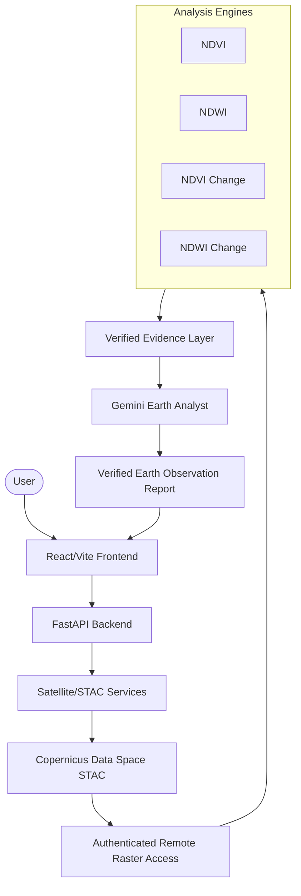

# EarthWatch AI
**AI-Powered Earth Change Detection & Geospatial Intelligence Platform**

EarthWatch AI is a geospatial intelligence platform that uses real satellite observations to analyze environmental signals and temporal change. The application provides an end-to-end analytical pipeline, from raw satellite discovery and spectral raster processing to evidence-grounded AI synthesis and reporting.

## Project Overview

EarthWatch AI is not a generic dashboard with mock data. It integrates real-time Copernicus Data Space Ecosystem (CDSE) APIs to query and analyze genuine Sentinel-2 Level-2A orbital acquisitions.

**Currently Implemented Capabilities:**
- Real Copernicus Data Space STAC integration
- Sentinel-2 Level-2A scene discovery
- Real scene preview and metadata parsing
- STAC asset inspection
- Authenticated remote raster access
- NDVI (Normalized Difference Vegetation Index) analysis
- NDWI (Normalized Difference Water Index) analysis
- Before/after NDVI change detection
- Before/after NDWI change detection
- Evidence-grounded AI Earth Analyst
- Verified Earth Observation reports
- Environmental Intelligence dashboard
- Neutral Disaster Monitor / signal monitor
- Reports module
- Settings/system configuration view

*Note: The Disaster Monitor presents analytical spectral signals and does not independently establish confirmed real-world disaster events (e.g., confirmed flood or drought emergencies).*

## Key Features

- **Real Data Acquisition:** Directly queries live orbital catalogs and retrieves accurate scene metadata, cloud coverage, and preview thumbnails via STAC API.
- **Spectral Analysis:** Computes robust vegetation and water indices using scientific bands on demand without downloading massive, unnecessary planetary tiles.
- **Change Detection:** Calculates precise temporal matrices to map environmental shifts across customizable baseline and observation windows.
- **AI Interpretation:** Utilizes Gemini to interpret verified spectral telemetry (not raw imagery) safely, acknowledging the limits of geospatial telemetry.
- **Reporting:** Generates professional, structured Earth Observation documents delineating measurable telemetry from AI synthesis.
- **Data Quality:** Transparently documents missing data, cloud cover interference, and limitations of remote sensing analysis.

## Data Source

**Copernicus Data Space Ecosystem (CDSE)**
- **Current STAC API:** `https://stac.dataspace.copernicus.eu/v1/`
- **Collection:** `sentinel-2-l2a`

The application uses Sentinel-2 Level-2A observations. It avoids downloading full, heavy Sentinel-2 products by employing an authenticated remote raster access workflow that efficiently inspects selected 512×512 pixel windows.

## Analysis Methods

The platform calculates indices using standard spectral formulas on Sentinel-2 bands:

- **NDVI:** `(B08 - B04) / (B08 + B04)`
- **NDWI:** `(B03 - B08) / (B03 + B08)`
- **Change Detection:** `After Index - Before Index`

### Configured Analytical Thresholds
*Note: Classifications are analytical spectral thresholds and are NOT ground-truth labels.*

**NDVI Baseline:**
- `< 0.2` = water_or_bare
- `0.2` to `< 0.4` = sparse
- `0.4` to `< 0.6` = moderate
- `>= 0.6` = dense

**NDVI Change:**
- `<= -0.20` = significant loss
- `> -0.20` to `<= -0.05` = moderate loss
- `> -0.05` to `< 0.05` = stable
- `>= 0.05` to `< 0.20` = moderate gain
- `>= 0.20` = significant gain

**NDWI Baseline:**
- `< 0.0` = non-water/low signal
- `0.0` to `< 0.2` = low water signal
- `0.2` to `< 0.4` = moderate water signal
- `>= 0.4` = high water signal

**NDWI Change:**
*Utilizes the same verified change thresholds as the NDVI pipeline applied to water signal variations.*
*Note on NDWI: NDWI represents a spectral water signal and should not by itself be interpreted as confirmed flooding, drought, inundation, or water-body expansion/disappearance.*

## AI Earth Analyst

- **Model:** Google Gemini (configured for `gemini-3.8-flash`)
- **Integration:** The AI receives structured, verified statistical evidence. Raw satellite imagery and raw NDVI/NDWI Float32 matrices are **not** sent to Gemini.
- **Governance:** The AI is instructed to remain evidence-grounded. Unsupported causal claims are prohibited, and environmental interpretations acknowledge relevant satellite limitations. No API keys are exposed to the frontend.

## Verified Report Generation

The report system compiles verified analytical evidence into a structured Earth Observation Report, clearly distinguishing measured mathematical values from AI interpretation.

**Report Sections:**
- Metadata
- Executive Summary
- Acquisition
- Methodology
- Vegetation Analysis
- Water Signal Analysis
- Change Detection
- AI Analysis
- Data Quality
- Technical Metadata

## System Architecture



## Technology Stack

**Frontend:**
- React, Vite, JavaScript, CSS
- HTML5 Canvas (for high-performance Float32 scientific raster visualization)

**Backend:**
- Python, FastAPI, Uvicorn, Pydantic

**Geospatial / Analysis:**
- Rasterio, NumPy, STAC / HTTP APIs

**AI:**
- Google Gemini (via Google GenAI SDK)

**Testing & QA:**
- Pytest, ESLint, Vite Production Build

## Project Structure

```text
EarthWatch-AI/
├── backend/
│   ├── app/
│   │   ├── api/          # FastAPI routing and endpoints
│   │   ├── core/         # Configuration and security
│   │   └── services/     # Raster, satellite, analysis, and AI logic
│   ├── tests/            # Pytest suites
│   ├── .env.example      # Environment template
│   └── requirements.txt  # Python dependencies
├── frontend/
│   ├── public/
│   └── src/
│       ├── components/   # UI panels, layouts, maps, and icons
│       ├── config/       # API endpoint mappings
│       ├── pages/        # Dashboard, Analytics, Environmental, etc.
│       ├── App.jsx       # Root routing and global state
│       └── main.jsx      # Entry point
├── datasets/             # Directory for local imagery and exports
├── models/               # Model tracking directory
├── notebooks/            # Jupyter environments for R&D
├── reports/              # Exported Earth Observation Reports
└── scripts/              # Utility tasks and automation
```

## API Overview

*All backend routes are dynamically mapped and documented via FastAPI/Swagger natively.*

**System & Satellite Services:**
- `GET /health` - System status
- `GET /api/v1/satellite/sources` - Available satellite catalogs
- `POST /api/v1/satellite/search` - STAC queries
- `GET /api/v1/satellite/scenes/{scene_id}/preview` - Thumbnail proxies
- `GET /api/v1/satellite/scenes/{scene_id}/assets` - STAC asset mapping
- `POST /api/v1/satellite/scenes/{scene_id}/raster/inspect` - Remote raster evaluation

**Analysis & Intelligence:**
- `POST /api/v1/analysis/ndvi` - Baseline NDVI calculation
- `POST /api/v1/analysis/ndwi` - Baseline NDWI calculation
- `POST /api/v1/analysis/change-detection` - NDVI temporal change matrix
- `POST /api/v1/analysis/ndwi-change` - NDWI temporal change matrix
- `POST /api/v1/analysis/evidence` - Structured statistical compilation
- `POST /api/v1/analysis/ai-analyst` - Gemini intelligence synthesis
- `POST /api/v1/reports/earth-observation` - End-to-end verified reporting

## Local Setup

**1. Clone the repository:**
```powershell
cd C:\Users\VEER\EarthWatch-AI
```

**2. Backend Environment:**
```powershell
cd backend
python -m venv venv
.\venv\Scripts\Activate.ps1
pip install -r requirements.txt
```

**3. Frontend Environment:**
```powershell
cd ../frontend
npm install
```

**4. Environment Variables:**
Duplicate `backend/.env.example` to `backend/.env` and securely populate your CDSE and Gemini keys.
*Important: The user must configure the required local credentials independently. Never place real credentials in this README.*

## Running the Application

**Start the Backend (Port 8000):**
```powershell
cd backend
.\venv\Scripts\Activate.ps1
uvicorn app.main:app --reload
```

**Start the Frontend (Port 5173):**
```powershell
cd frontend
npm run dev
```

## Testing

The project maintains strict continuous integration standards. Latest verified baseline:

**Backend:**
- 64 passed
- 10 warnings
*(Warning counts generally reflect upstream library evolutions like Pydantic/Starlette deprecation notices).*

**Frontend:**
- 0 lint errors
- 1 React effect dependency warning currently reported
- Production build succeeds

## Security

- `.env` is explicitly ignored by version control.
- Secrets are not committed anywhere in the codebase.
- Credentials must be stored locally and passed safely.
- API keys must never be placed in source code or UI files.
- Rotate credentials immediately if accidentally exposed to source control.

## Scientific Limitations

- **Analyzed Spatial Window:** Current analytical limits use selected 512×512 raster windows dynamically streamed into memory.
- **Resolution:** Analysis spatial resolution is currently calibrated to 10m based on the active Sentinel-2 workflow.
- **Analytical Abstractions:** Spectral thresholds are analytical estimates and do not represent localized ground truth.
- **Physical Events:** NDWI is a proxy for surface moisture/water and is not absolute proof of a specific hydrological disaster.
- **Interference:** Atmospheric conditions, soil moisture, cloud shadows, sun angles, and seasonal vegetative effects can heavily influence spectral measurements.
- **Interpretation:** Results should always be treated as supportive analytical evidence rather than automatic real-world confirmation.

## Current Status

The core end-to-end workflow is **operational**.
STAC discovery → scene selection → real scene preview → authenticated raster access → NDVI/NDWI → temporal change detection → evidence layer → AI interpretation → verified report.

*(EarthWatch AI is a demonstration/analysis platform and is not currently slated for widespread production deployment).*

## Roadmap

**FUTURE/PLANNED Items:**
- Broader AOI workflows
- GIS/vector drawing tools
- Larger-area asynchronous processing jobs
- Additional satellite provider integrations
- Richer geospatial map overlays
- Production deployment hardening

## License
License: Not yet specified.

## Author
Veer Singhi